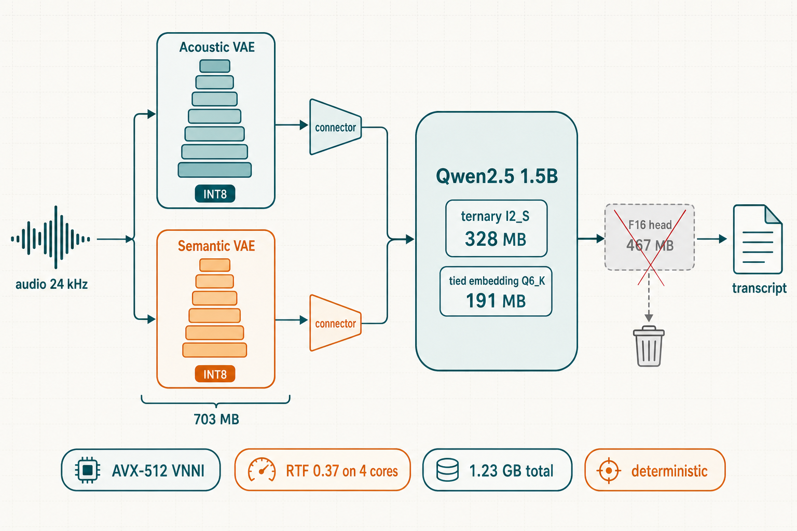

<h1 align="center">VibeASR.cpp — CPU-optimised fork</h1>

<p align="center">
  <a href="https://opensource.org/licenses/MIT"></a>
  <a href="https://huggingface.co/P2Enjoy/VibeVoice-ASR-BitNet-slim"></a>
  <a href="https://github.com/microsoft/VibeASR.cpp"></a>
</p>

---

This is a fork of [microsoft/VibeASR.cpp](https://github.com/microsoft/VibeASR.cpp)
focused on one question: **how fast and how small can VibeVoice-ASR-BitNet get on a
plain x86 CPU without losing accuracy?** Everything documented here is about the
fork; for the original project, its paper numbers and its documentation, see the
[upstream README](https://github.com/microsoft/VibeASR.cpp#readme).

<p align="center">
  
</p>

What the fork changes, all measured (see the results section below and the
[model card](https://huggingface.co/P2Enjoy/VibeVoice-ASR-BitNet-slim)):

- **2.56× faster than the upstream runtime** — paired per-clip median over the
  same 100 clips, same host, same threads; sub-real-time on a 4-vCPU VM.
  AVX-512/VNNI kernels with runtime dispatch, a packed-B INT8 GEMM with the
  dequantisation epilogue fused into the accumulator store, conv-as-GEMM
  downsampling that reads windows in place (no im2col, no transposes), and a
  layout-native depthwise convolution.
- **27% smaller model** (1.70 → 1.23 GB): the LM shipped its tied output projection
  twice; the F16 copy is dropped, at no measured accuracy cost — verified twice on
  different suites (+0.30 and +0.28 corpus WER, within per-language scatter that
  goes both ways; tables on the model card).
- **Deterministic**: identical transcripts at any thread count. Upstream output
  changed with `-t`; the fork removes every partition-dependent rounding path.
- **Portable binaries**: AVX2 baseline build with runtime dispatch up to VNNI —
  no `-march=native` time bombs.
- **A numerical fix**: the upstream AVX2 int8 kernels overflow their int16
  accumulators on full-range activations; the VNNI kernels accumulate in int32.
- **A reproduction harness**: every number in this README regenerates via
  `bench/run_all.sh`, with kernel-level exact-reference tests (`kernel_bench`).

---

## Quick Start

```bash
git clone --recursive -b claude/asr-cpu-optimization-cztnh9 \
    https://github.com/martinobettucci/VibeASR-bitnet.cpp.git
cd VibeASR-bitnet.cpp

pip install -r requirements.txt
python setup_env.py --skip-download     # builds portable binaries, applies patches/

./scripts/download_models.sh            # slim weights from P2Enjoy (1.23 GB)
```

### Run

```bash
./build/bin/asr_infer \
    --vae-model models/vibeasr/vibeasr-vae-encoder-i8_s.gguf \
    --lm-model  models/vibeasr/vibeasr-lm-i2_s-tied.gguf \
    --audio input.wav -t 4 --greedy
```

Gradio demo: `python demo/gradio_asr_demo.py --port 7860 --vae-model ... --lm-model ...`

### Weights

| | file | size |
|:--|:--|--:|
| LM (ternary I2_S + tied Q6_K embedding) | `vibeasr-lm-i2_s-tied.gguf` | 526 MB |

> The Qwen2.5-**1.5B** backbone is upstream's choice (they distilled down from 7B);
> this fork does not swap or retrain it. The only weight change here is dropping the
> LM's duplicated F16 output projection — the ternary body is byte-for-byte
> Microsoft's. Backbone swaps to smaller Qwens were investigated and rejected with
> measurements (see the negative-results section).
| VAE encoders (INT8) | `vibeasr-vae-encoder-i8_s.gguf` | 703 MB |

Hosted at [P2Enjoy/VibeVoice-ASR-BitNet-slim](https://huggingface.co/P2Enjoy/VibeVoice-ASR-BitNet-slim)
— the model card there is the authoritative source for accuracy tables and the
weight-surgery details. The original weights remain at
[microsoft/VibeVoice-ASR-BitNet](https://huggingface.co/microsoft/VibeVoice-ASR-BitNet)
and still work with this runtime unchanged.

Supported languages (measured): English, French, Italian, Portuguese from the
training mix; Spanish and German generalise usably. Other languages degrade sharply
— that is a property of the model's training data, not of this runtime.

---

## CPU optimisation on AVX-512

Work done on this fork. Reference hardware: **4-vCPU Intel Xeon (Cascade Lake class,
AVX-512F/BW/DQ/VL + VNNI) cloud VMs**. Every number is reproduced by
`./bench/run_all.sh`; methodology and per-script docs in [bench/README.md](bench/README.md).
Accuracy tables live on the [model card](https://huggingface.co/P2Enjoy/VibeVoice-ASR-BitNet-slim)
and are not duplicated here.

### Result: 2.56× the upstream engine, measured as a ratio

Absolute RTF numbers are a property of whatever VM a benchmark lands on — this
project measured the same binary drifting ±18% between sessions, and over 30%
*within* one session as its cloud host degraded. So everything is published as a
**ratio against the upstream runtime**, which is the number that transfers.

Baseline = upstream microsoft/VibeASR.cpp with the original 1.70 GB weights.
Speed > 1 means faster than that baseline. 4 threads, compute only (model load
excluded).

| Engine | de | en | es | fr | fr-MLS | it | pt | **WER all** | **speed × over baseline** |
|:--|--:|--:|--:|--:|--:|--:|--:|--:|--:|
| Upstream Microsoft runtime, original 1.70 GB weights | 16.7 | 6.6 | 5.8 | 32.7 | 21.6 | 8.3 | 10.8 | **15.75** | 1.00× (baseline) |
| **This fork** (all optimisations, default) | 15.6 | 6.6 | 7.1 | 33.6 | 21.9 | 8.6 | 11.1 | **16.07** | **2.35×** |
| This fork, bit-exact mode (`VIBEASR_RES_FUSE=0`) | 13.9 | 7.2 | 5.8 | 35.4 | 21.2 | 10.2 | 10.5 | **16.03** | **2.01×** |
| whisper.cpp small q5_1 | 8.5 | 4.6 | 7.1 | 12.9 | 16.7 | 6.6 | 8.0 | **9.92** | **3.06×** |
| whisper.cpp large-v3-turbo q5_0 | 4.1 | 3.7 | 4.0 | 3.3 | 10.3 | 3.3 | 4.3 | **5.12** | **0.75×** |

**Methodology, because the two columns come from different runs on purpose.**
WER is from full 100-clip runs per engine (deterministic per engine — host noise
cannot touch it). Speed is from a separate *interleaved* run (`n=12` clips
spanning all seven sets) where every engine transcribes each clip back to back,
so both halves of every ratio share one noise window. Sequential
phase-per-engine timing was tried first and rejected: drift between phases was
large enough to invert a ratio known to be 1.15×. Whisper received each clip's
language code; this model ran unhinted. Reproduce with `bench/speed_test.py`,
`bench/whisper_bench.py`, `bench/interleaved_speed.py`, `bench/final_table.py`.

**Reading it honestly.** The engine claim is clean: **2.35× the upstream runtime
at unchanged accuracy** (+0.32 WER, and the per-language deltas scatter both ways
— German improves 1.1 points under the overflow-fixed kernels, Spanish loses
1.3). The model claim is not: on this corpus **whisper-small is both more
accurate and ~1.3× faster than this fork**, and turbo is far more accurate still.
An earlier sequential measurement here reported whisper-small at parity; the
interleaved run corrects that in whisper's favour.

What this stack offers is not short-clip WER — see the next section.

### What the optimised runtime actually buys

The table above is measured on 5–25 second clips — whisper's home turf and this
architecture's worst case. It says nothing about what VibeVoice-ASR is *for*, so
here is the case stated plainly.

The architecture's advantages were always structural, and always the same three:

- **Single-pass long-form.** 3200× audio compression into an LLM context means an
  hour of audio is *one* encode and one prefill. whisper.cpp processes a fixed
  30 s window at a time — an hour is ~120 windows, with state carried across
  seams, boundary artefacts, and VAD/stitching glue around it.
- **Speakers and timestamps natively.** Segment boundaries and speaker labels come
  out of the same decoding pass, as JSON. Whisper emits none of that; diarization
  means bolting on a second system that often costs more than the ASR.
- **An LLM decoder.** Context conditioning, output formatting, and decoder-level
  hotword biasing (`--hotwords`, +4 WER points recovered on French) are natural
  operations on a Qwen — not bolt-ons.

What they were *not*, before this fork, is usable on a CPU. At upstream's speed
those properties were academic: you cannot hold a live stream below real time,
and for batch work people just used a GPU. **That is what the optimisation bought
— it made the architecture's advantages affordable.** Transcription plus speakers
plus timestamps plus biasing plus single-pass long-form, now in the same compute
envelope as bare whisper-small transcription.

The benchmark that would show this properly is long-form, not clip-level; it is
the next thing on the list, and this section will carry its numbers when it lands.

### Where the time went, measured

A per-node graph profiler (`VIBEASR_NODE_PROFILE=1`, sections named per encoder
stage) drove every optimisation. The headline findings, in the order they were found:

1. **Per-call overhead, not arithmetic.** The GEMM row blocks were 4, issuing 194M
   `vec_dot` calls per clip at ~2% of int8 peak. Tuned to 32 (`bench/row_block_sweep.sh`).
2. **The AVX2 kernels were numerically wrong.** int16 accumulation of `vpmaddubsw`
   wraps on full-range int8; the AVX-512 VNNI kernels accumulate in int32.
   `kernel_bench --check` validates 1661 points against exact scalar references.
3. **A register-tiled INT8 GEMM** (4×4 int32 accumulator tile, +128 weight-bias trick
   instead of a per-pair sign fold): ~2× kernel throughput over the blocked vec_dot.
4. **Scalar epilogues.** After every fused matmul the runtime made two scalar passes
   (dequant+absmax, then `roundf` per element) over multi-megabyte activations —
   vectorised, bit-exact by construction.
5. **Data movement was 41% of graph time** (CONT transposes 23.5% + IM2COL 17.3%).
   The ConvNeXt mixer's `permute→cont→im2col→matmul→cont` chain is now one
   layout-native depthwise-conv node (`dw_direct`): the [dim, frames] layout makes the
   causal k-tap conv k fused multiply-adds over contiguous vectors. Data movement fell
   to 8%; byte-identical transcripts with the old chain (`VIBEASR_DWCONV=0`).
6. **The GEMM tile was reduction-bound at small K.** The early encoder stages run
   tall-thin matmuls (K = 32–512 bytes, tens of thousands of rows); a 4×4 tile
   ending in 16 horizontal reductions costs more than its vpdpbusd work, and K=32
   missed the tile gate entirely. The packed-B kernel repacks weights once per
   tensor (at model load) into the layout `vpdpbusd` natively consumes, accumulates
   16 output channels vertically — no horizontal reductions, K%4 granularity — and
   fuses the int32→float scale+bias+absmax epilogue into the accumulator store, so
   the int32 buffer, its memset and the separate dequantisation pass disappear.
   Acoustic encoder 1.26× (7-rep interleaved medians); bit-exact
   (`VIBEASR_GEMM_PACKED=0` restores the unfused sequence).
7. **im2col was never necessary.** In the [C, T] stage layout a strided-conv window
   of KW frames × IC channels is one contiguous slice of KW·IC bytes, so the packed
   GEMM reads downsample windows straight out of the activation tensor with a row
   stride of s·IC — and the [C,T]→[T,C] transpose feeding each conv dies with it
   (12 of 14 im2col nodes and all 14 per-stage transposes). VAE 1.44× on top of
   everything above; bit-exact (`VIBEASR_CONV_GEMM=0`).
8. **Residual fusion — the one deliberate numerics change.** Every ConvNeXt block
   half ended with ADD_SCALED: quantise the mixer/FFN output, re-read it,
   dequantise, apply the layer scale, add the residual. Fused into the producer's
   epilogue (in place over the cache-warm float buffer), only the *sum* is
   quantised — one DRAM round trip and one quant→dequant round trip per block half
   gone. Not bit-exact by construction, so it was gated on the 100-clip suite:
   **+0.04 corpus WER** (16.07 vs 16.03, per-language scatter in both directions)
   for acoustic 1.35× / semantic 1.19×. Default on; `VIBEASR_RES_FUSE=0` restores
   the exact chain.

### Determinism

Transcripts previously depended on thread count. Bisection with per-stage tensor
dumps traced it to vector/scalar boundaries that moved with the thread partition
while computing different roundings (FMA contraction, reciprocal-vs-divide, nearest-
even vs half-away). All hot paths now use masked full-width AVX-512 with no scalar
edges: **output is byte-identical at `-t 1/2/3/4`**, verified by transcript hashes.

### Portability

The build defaults to `GGML_NATIVE=OFF` (AVX2 baseline + runtime dispatch to
AVX-512/VNNI in our kernels). This is learned the hard way: a `-march=native` build
died with SIGILL when the VM migrated to a host without AVX512-FP16. One binary now
serves every x86-64-with-AVX2 host and still lights up VNNI where present.

### Negative results, kept on record

- **Stage-6 truncate-and-project** (ridge regression, H3-style): cosine 0.92–0.98 to
  the full encoder, but WER doubles — an autoregressive consumer propagates what a
  one-shot diffusion consumer absorbs. Also targeted parameters, not time: the last
  stage holds 89% of VAE FFN weights and ~4% of VAE runtime. Apparatus retained
  (`bench/stage6_calib.py`, `VIBEASR_STAGE6_PROJ`).
- **Prompt hotwords** (`--context-info`): oracle proper nouns took French from 36%
  to 90% WER — conditioning derails autoregressive decoding. The decoder-level fix
  was then built, and it works: `--hotwords a,b,c --hotword-boost 5` (token-trie
  logit biasing, `utils/hotword_boost.h`) takes FLEURS-French **36.0 → 31.9%** with
  oracle terms, while the poison control — the *wrong* clip's terms at the same
  strength — does not degrade the baseline (34.8). λ=8 is past the stability knee:
  the boost out-argues `<|im_end|>` and generation runs away, so 5 is the
  documented ceiling. Off by default; the flag-absent decode path is byte-identical,
  hash-verified. (`bench/hotword_eval.py` reproduces the four-condition table.)
- **Q8_0 output head**: no accuracy gain over the tied Q6_K embedding (corpus 13.81
  vs 13.65) for +248 MB.
- **Parallel encoders on 4 cores**: the acoustic and semantic graphs are
  independent and the code can run them concurrently on pinned disjoint cores
  (without pinning, two ggml pools spin-waiting at node barriers on shared cores
  measured 3.5× *slower* than sequential). But on 4 cores it loses anyway —
  semantic is latency-bound (~1.1 s at any thread count) while acoustic scales to
  every core it is given: pinned 2+2 measured 6.25 s vs 3.44 s sequential. The
  machinery ships default-on at ≥ 6 threads (`VIBEASR_PAR_ENC=1/0` forces).

### Runtime switches

Every optimisation ships with its kill switch, so any single step can be A/B'd on
any host. Defaults are what the benchmarks above measure.

| Switch | Default | Effect of overriding | Measured basis for the default |
|:--|:--|:--|:--|
| `VIBEASR_GEMM_PACKED=0` | on | unfused tiled GEMM + separate dequant pass | packed: acoustic 1.26×, bit-exact |
| `VIBEASR_CONV_GEMM=0` | on | im2col + transpose downsampling | conv-as-GEMM: VAE 1.44×, bit-exact |
| `VIBEASR_RES_FUSE=0` | on | unfused ADD_SCALED chain (bit-exact mode) | fusion: 1.17× corpus at +0.04 WER |
| `VIBEASR_DWCONV=0` | on | permute/im2col mixer chain | dw_direct: 1.40–1.46×, bit-exact |
| `VIBEASR_PAR_ENC=1/0` | on at ≥ 6 threads | force/forbid concurrent encoders | loses on 4 cores (6.25 s vs 3.44 s) |
| `VIBEASR_GEMM_TILE=0` | on | pre-tile blocked vec_dot (fallback path only) | tile: ~2× kernel throughput |
| `VIBEASR_I2_NX1_VNNI=1` | off | VNNI for LM I2_S Nx1 | AVX2 measured faster (87 vs 45 GMAC/s) |
| `VIBEASR_ISA=avx2\|avx512\|vnni` | auto | cap the dispatched ISA | — |
| `VIBEASR_ISA_VERBOSE=1` | off | print the dispatched ISA at start | — |
| `VIBEASR_NODE_PROFILE=1` | off | per-node/section graph profiler | (run with `VIBEASR_PAR_ENC=0`) |
| `VIBEASR_KERNEL_STATS=1` | off | per-kernel time/GMAC table at exit | — |
| `VIBEASR_GEMM_SHAPES=1` | off | print every GEMM call's shape | the tile-tuning census |
| `VIBEASR_STAGE6_PROJ=<f>` / `VIBEASR_TAP_STAGE` / `VIBEASR_TAP_MARKS` | off | stage-6 truncation apparatus | negative result, kept on record |

### Tools this added

| | |
|:--|:--|
| `tools/requant_lm_head.cpp` | re-quantise or drop one tensor of an I2_S GGUF |
| `bench/kernel_bench` | exact-reference kernel validation + throughput |
| `bench/run_all.sh` | full reproduction: build → models → sweeps → tables |
| `bench/speed_test.py` | N-clip RTF distribution + hypotheses on one engine |
| `bench/whisper_bench.py` | the same clip draw through whisper.cpp |
| `bench/relative_report.py` | WER + paired speed ratios across engine result files |
| `bench/model_report.py` | per-tensor bit-budget of a GGUF |
| `VIBEASR_NODE_PROFILE` / `VIBEASR_KERNEL_STATS` | graph and kernel profilers |
| `patches/0001-ggml-i8s-fast-paths.patch` | all submodule changes, applied by `setup_env.py` |

---

## Notes for Windows

Windows builds require **GCC or Clang** — MSVC is rejected by `src/CMakeLists.txt`.
MinGW-w64 (e.g. [WinLibs](https://winlibs.com/)) is recommended:

```bash
cmake -B build -G "MinGW Makefiles" -DCMAKE_BUILD_TYPE=Release \
    -DCMAKE_C_COMPILER=gcc -DCMAKE_CXX_COMPILER=g++ -DCMAKE_MAKE_PROGRAM=mingw32-make
cmake --build build --target asr_infer -j
```

Keep the MinGW `bin` dir on `PATH` at runtime so the executables find their DLLs.

---

## Rebuilding the slim weights yourself

The slim LM is produced from the original release with one tool — no retraining:

```bash
./scripts/download_models.sh            # or start from the microsoft GGUFs
./build/bin/requant_lm_head original-lm.gguf slim-lm.gguf --drop
python bench/model_report.py slim-lm.gguf      # verify the bit budget
```

For full SafeTensors → GGUF conversion, follow the
[upstream instructions](https://github.com/microsoft/VibeASR.cpp#model-conversion);
the conversion scripts in `utils/` are unchanged in this fork.

---

## Upstream project & citation

The original project, its technical report, evaluation on the paper's benchmarks,
and the unmodified documentation live at
[microsoft/VibeASR.cpp](https://github.com/microsoft/VibeASR.cpp). If you use this
work academically, cite their report:

```bibtex
@article{xu2025vibeasrbitnet,
    title={VibeVoice-ASR-BitNet Technical Report},
    author={Xu, Songchen and Song, Ting and Huang, Shaohan and Peng, Zhiliang and Xia, Yan and Tu, Yujie and Huang, Xin and Yu, Jianwei and Dong, Li and Wei, Furu},
    journal={arXiv preprint arXiv:2607.21075},
    year={2025}
}
```

---

## License

MIT, as upstream.
